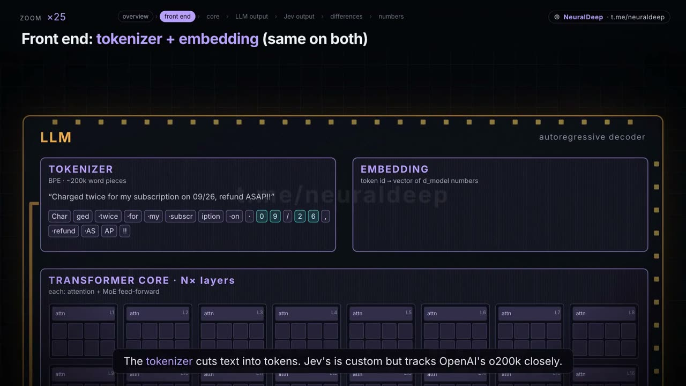

https://github.com/user-attachments/assets/751d01c0-2dc6-427d-b00d-ec5d7f2c0249

# nd-video-studio

Explainer videos in HTML: compositions in [HyperFrames](https://github.com/heygen-com/hyperframes)
(Apache 2.0) → MP4, plus narrator, music and mixing on NeuralDeep infrastructure.
The whole pipeline is described in the [`skills/nd-video/SKILL.md`](skills/nd-video/SKILL.md) skill,
picked up by Claude Code (`.claude/skills`) and Codex/Cursor (`.agents/skills`).

## Example: LLM vs Jev

[](media/jev-vs-llm.mp4)

[`media/jev-vs-llm.mp4`](media/jev-vs-llm.mp4): 1080p, 112 s, 8.7 MB. The first video made with this
pipeline: a camera flying over two architecture "crystals", a magnifier for details, word-level
subtitles, narrator with the `trailer` preset and ducked music.

## What's inside

| path | what |
|---|---|
| `skills/nd-video/` | skill: from idea to MP4 (HyperFrames techniques, voice, music, mixing) |
| `skills/ndt-content/` | skill: a video from a brief entirely on hub models (research, script, voice, images, checks, review) |
| `scripts/nd_probe.py` | availability check of every hub model and endpoint the pipeline uses |
| `scripts/nd_research.py` | research via the hub Search API → `sources.md` |
| `scripts/nd_script.py` | script by a hub model: brief + sources → `narration.json` with scenes |
| `scripts/nd_retime.py` | line starts from the real voiceover, before laying out the HTML |
| `scripts/nd_align.py` | `whisper-1`: voiceover vs text check and word timings `words.json` |
| `scripts/nd_images.py` | hub FLUX images, background removal, upscale |
| `scripts/nd_review.py` | contact-sheet review by a hub vision model |
| `scripts/music_studio.py` + `tools/music-studio.html` | local music studio on top of self-hosted ACE-Step: presets, variants, history, "to project" |
| `scripts/beat_map.py` + `tools/beat-sync.js` | track beat map (beats, downbeats, hits) and binding animation to it, time warp |
| `scripts/tts_gpt_audio.py` | narrator via OpenAI gpt-audio (OpenRouter), with a verbatim check |
| `scripts/tts_hub.py` | narrator via the hub TTS (`/v1/audio/speech`) |
| `scripts/music_lyria.py` | music via Google Lyria 3 (OpenRouter) |
| `scripts/music_acestep.py` | music via self-hosted ACE-Step 1.5 ([docs/acestep.md](docs/acestep.md)) |
| `scripts/fit_narration.py` | sync: lines into timeline windows, silence trimming, atempo |
| `scripts/voice_fx.py` | EQ, compression, convolution reverb; presets and A/B |
| `scripts/mix.py` | voice and music mixed with ducking into one wav |
| `scripts/build_audio.sh` | fit → fx → mix in one command |
| `scripts/sync_hyperframes.sh` | update the vendored HyperFrames skills |
| `vendor/hyperframes/` | vendored HyperFrames skills and docs + their LICENSE ([NOTICE](vendor/hyperframes/NOTICE.nd-video-studio)) |

## Quick start

```bash
mkdir -p projects/my-video && cd projects/my-video    # projects/ are local, not tracked in git
env -u HTTPS_PROXY -u HTTP_PROXY -u https_proxy -u http_proxy -u ALL_PROXY npx -y hyperframes@0.8.81 init . --example blank
# narration.json → voice (tts_hub.py) → build_audio.sh → render; step by step in skills/ndt-content/SKILL.md
bash ../../scripts/build_audio.sh . trailer
env -u HTTPS_PROXY -u HTTP_PROXY -u https_proxy -u http_proxy -u ALL_PROXY npx -y hyperframes@0.8.81 render --output renders/my-video.mp4
```

Requires Node 22+, FFmpeg, Python 3.10+ (standard library only).

## Keys

`OPENROUTER_API_KEY` (gpt-audio, Lyria; OpenRouter returns 403 from Russian IPs), `ND_API_KEY` (hub),
`ACESTEP_API_KEY` (if the ACE-Step server is key-protected). Keep them in `.env`, it's in `.gitignore`.

## License

[MIT](LICENSE). `vendor/hyperframes/` stays under its own Apache License 2.0 ([LICENSE](vendor/hyperframes/LICENSE)).
